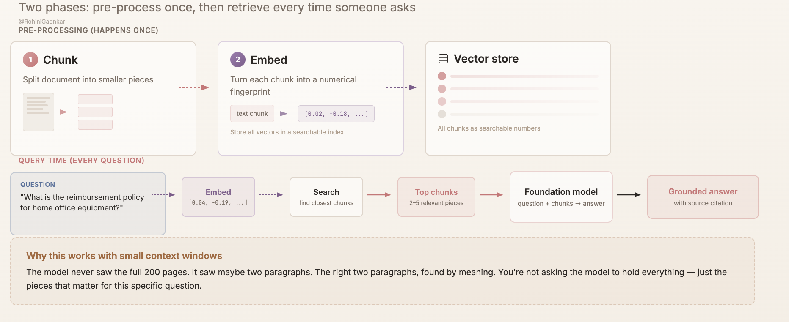
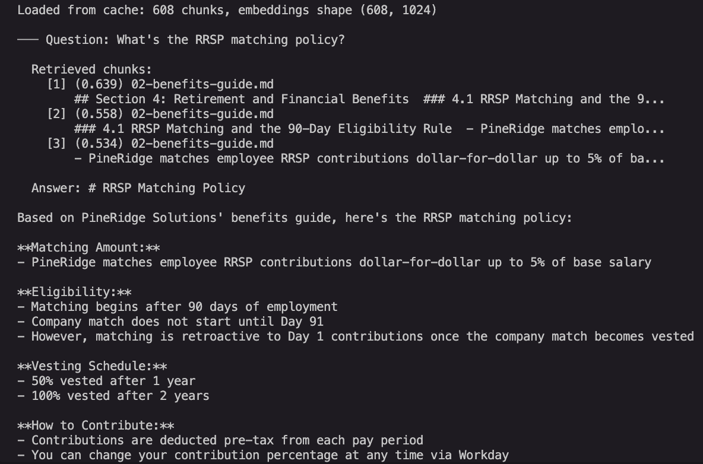
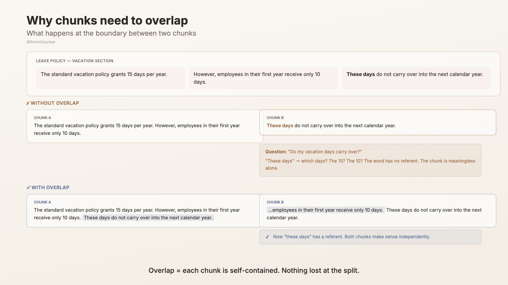

# Episode 5: Talking to a document — RAG from scratch

A working RAG pipeline in about 60 lines of Python, running on [Amazon Bedrock](https://aws.amazon.com/bedrock?trk=44b16281-e090-49b6-97d8-f1cea54d9e87&sc_channel=el). No vector database, no LangChain, no abstractions to hide behind. Just the four steps that make RAG work, against onboarding docs for a fictional company called PineRidge Solutions.

## 📺 Watch and/or read

This repo is the code companion for Episode 5 of *Learning AI Out Loud*. The video and blog walk through the *why* behind each step. This README covers the *how* of running it.

- 🎥 **Video:** [How to make AI answer from YOUR documents](https://www.youtube.com/watch?v=YOUR_VIDEO_ID)
- 📝 **Blog:** [How to make AI answer questions about your documents — building RAG from scratch](https://dev.to/aws/YOUR_BLOG_SLUG)
- 📺 **Series playlist:** [Learning AI Out Loud](https://youtube.com/@RohiniGaonkar)

## What this demo does

You have six onboarding documents for a new joiner. Employee handbook, benefits guide, leave policy, expense rules, engineering onboarding, IT security. Thousands of lines. The answer to "what's our RRSP match?" is buried in there somewhere.

Ask a LLM the same question and you'll get a confident, plausible-sounding answer that's completely made up. The model has no idea what *your* company does.

RAG fixes that. Search first, then answer. Three steps, one loop.



The pipeline:

1. **Chunk** the docs into paragraph-sized pieces (with a bit of overlap so meaning doesn't get cut at the seams).
2. **Embed** each chunk with [Amazon Titan Embeddings V2](https://aws.amazon.com/bedrock/titan?trk=44b16281-e090-49b6-97d8-f1cea54d9e87&sc_channel=el) so similar meanings end up close together in vector space.
3. **Retrieve** the chunks closest to the question using cosine similarity.
4. **Generate** the answer with Claude Haiku, grounded in the retrieved chunks.

The blog and video unpack each step properly. This README focuses on getting it running on your machine.

## Setup

From the repo root (one level up from this folder):

```bash
python3 -m venv .venv
source .venv/bin/activate
pip install -r requirements.txt
```

You also need:

- AWS credentials configured (`aws configure` or an SSO profile)
- Amazon Bedrock **model access** enabled for both models below in `us-east-1`. Enable this once per account from the Bedrock console under *Model access*.

## Run

```bash
python3 rag_demo.py
```

**First run** chunks the six docs, embeds every chunk (~30 seconds), saves the cache, then runs the question. **Subsequent runs** skip straight to retrieval and generation.

To force a re-embedding, delete the `cache/` folder.

## What you'll see

```
STEP 1: Chunking documents...
  N chunks from 6 documents.

STEP 2: Embedding chunks...
  Done — N chunks embedded.

─── Question: What's the RRSP matching policy?

  Retrieved chunks:
    [1] (0.7xx) 02-benefits-guide.md ...
    [2] (0.6xx) 02-benefits-guide.md ...
    [3] (0.5xx) 01-employee-handbook.md ...

  Answer: PineRidge matches ...
```

The score next to each retrieved chunk is the cosine similarity. Higher is better. If your top score is below ~0.4, the knowledge base probably doesn't contain the answer. That's a useful signal in its own right.

Here's what it looks like when it works:



## Files

```
ep05-rag-pipeline/
├── rag_demo.py        # The full pipeline, ~200 lines, heavily commented
├── documents/         # 6 fictional PineRidge policy docs (knowledge base)
│   ├── 01-employee-handbook.md
│   ├── 02-benefits-guide.md
│   ├── 03-leave-policy.md
│   ├── 04-expense-and-travel-policy.md
│   ├── 05-engineering-onboarding.md
│   └── 06-it-security-policy.md
└── cache/             # Auto-generated on first run
    ├── chunks.json    # Chunk text + source filenames
    └── embeddings.npy # NumPy matrix of chunk vectors
```

## Try it yourself

A few small experiments that teach a lot:

- **Ask a question the docs don't cover.** Watch the top similarity scores drop and see how Claude responds when the grounded context is weak.
- **Change `top_k`** in `retrieve()` from 3 to 1. Notice answers get thinner. Push it to 10 and watch the prompt bloat without much accuracy gain.
- **Remove the overlap** in `chunk_docs()` (set `start = i` instead of `i - 1`). Try a question whose answer spans a paragraph boundary and see retrieval get worse.

  

- **Drop the "use ONLY the context" instruction** in `generate_answer()`. The model will start filling gaps with general knowledge, sometimes wrong. That's the hallucination RAG is meant to suppress.

## Models used

| Step | Model | Why |
|------|-------|-----|
| Embed | `amazon.titan-embed-text-v2:0` | Fast, cheap, 1024-d vectors, runs on Bedrock |
| Generate | `us.anthropic.claude-haiku-4-5-20251001-v1:0` | Cheapest Claude tier, plenty for grounded Q&A |

Both run in `us-east-1`. Switch regions or models by editing the constants at the top of `rag_demo.py`.

## What's next

This is the simplest end-to-end RAG you can build. It works great when retrieval finds the right piece. But what happens when chunks are too small and the answer gets cut in half? When the question needs information scattered across multiple sections?

Episode 6 picks up from here, breaks this pipeline on purpose, and walks through the toolkit of strategies that make retrieval actually reliable. [Ride along](https://youtube.com/@RohiniGaonkar).
